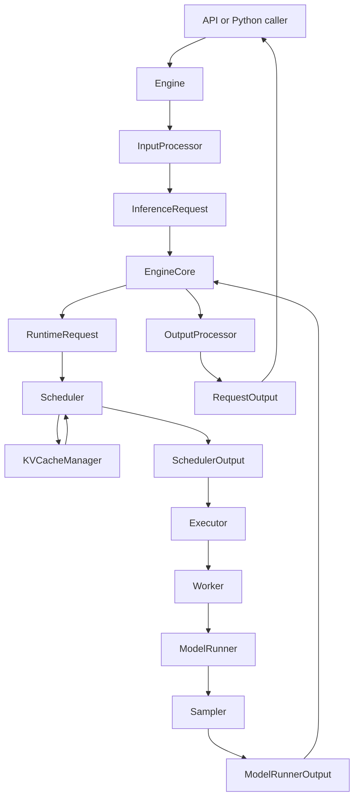
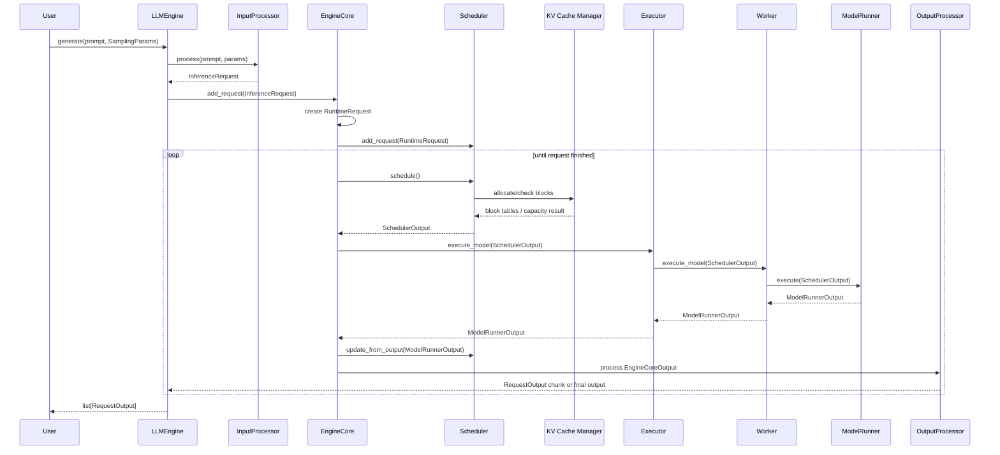
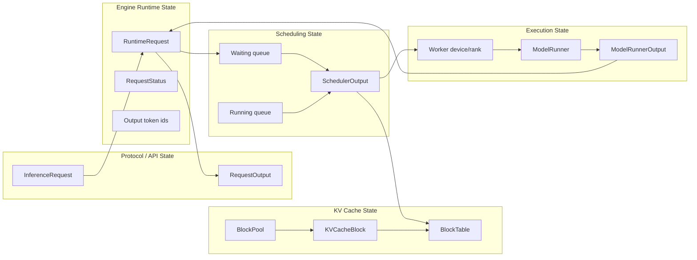

# Simple Infer Architecture

This document describes the architecture of `simple-infer`, a modular
inference framework.

## Architectural Principles

The engine is split into layered stages that each own one concern:

```text
entrypoints
  -> input processor
  -> engine
  -> engine core
  -> scheduler
  -> KV cache manager
  -> executor
  -> worker
  -> model runner
  -> sampler / output processor
```

- Protocol code must not leak into scheduler or model runner code.
- Request state is explicit and owned by the runtime after admission.
- Continuous batching needs separate token, request, and KV budgets.
- KV cache is an allocator and page table, not just a tensor.
- Executors hide process and distributed details from the engine core.
- Workers own rank-local device state.
- Model runners own backend-specific tensor construction and forward passes.
- Output processing owns detokenization, streaming deltas, finish reasons, and
  request-visible response shape.

## Target Architecture

The project should use a layered architecture with narrow contracts:

```text
simple_infer
  config
  protocol
  inputs
  entrypoints
  engine
  core
  scheduler
  kv_cache
  executor
  worker
  model_runner
  sampling
  outputs
  metrics
  testing
  utils
```

## Data Flow

This section is the implementation guide for the runtime path. Every layer
should have one clear input object and one clear output object. If an
implementation needs to reach across layers, that is a design smell.

### One Request Example

Example user request:

```python
from simple_infer import LLMEngine
from simple_infer.sampling import SamplingParams

engine = LLMEngine(model="path/to/model")

outputs = engine.generate(
    prompts=["Write one sentence about GPU memory."],
    sampling_params=SamplingParams(
        max_tokens=8,
        temperature=0.0,
    ),
)
```

The request should move through the system like this:

```text
1. api / direct Python call
   input:
     prompt = "Write one sentence about GPU memory."
     max_tokens = 8
   output:
     user-facing call into LLMEngine.generate()

2. Engine
   input:
     raw prompt string
     SamplingParams
   actions:
     validates user arguments
     asks Input Processor to tokenize/render prompt
     assigns request id, for example "req-0001"
   output:
     InferenceRequest

3. Engine Core
   input:
     InferenceRequest
   actions:
     creates mutable RuntimeRequest
     registers it with Scheduler
   output:
     RuntimeRequest stored in active request table

4. Scheduler
   input:
     waiting/running RuntimeRequest objects
     token budget, request budget, KV budget
   actions:
     decides this request should run prefill
     asks KV Cache Manager for blocks
   output:
     SchedulerOutput(
       scheduled_request_ids=["req-0001"],
       prefill_request_ids=["req-0001"],
       decode_request_ids=[],
       token_budget_used=<prompt_len>,
       block_tables={...},
     )

5. Executor
   input:
     SchedulerOutput
   actions:
     forwards work to the local Worker
   output:
     ModelRunnerOutput from Worker

6. Worker
   input:
     SchedulerOutput
   actions:
     owns device, loaded model, rank-local state
     calls Model Runner
   output:
     ModelRunnerOutput

7. Model Runner
   input:
     scheduled request metadata and token ids
   actions:
     builds tensors
     calls model forward
     samples next token or returns logits to sampler
   output:
     ModelRunnerOutput(
       request_ids=["req-0001"],
       sampled_token_ids=[[1234]],
     )

8. Engine Core + Scheduler update
   input:
     ModelRunnerOutput
   actions:
     appends sampled token to RuntimeRequest
     updates computed token count
     checks stop/eos/max_tokens
     either keeps request running or marks it finished
   output:
     EngineCoreOutput

9. Output Processor
   input:
     EngineCoreOutput
   actions:
     detokenizes new token ids
     formats final or streaming output
   output:
     RequestOutput
```

The main invariant is that each boundary changes the data shape for a reason.
Do not pass raw API payloads down into scheduling or backend code.

### High-Level Graph



### Sequence Diagram



### Object Ownership Graph



Ownership rules:

- `api` owns protocol payloads only.
- `engine` owns user-facing methods and output formatting.
- `core` owns live request lifecycle.
- `scheduler` owns queues and scheduling decisions.
- `cache` owns block allocation and block tables.
- `executor` owns dispatch topology.
- `worker` owns rank-local device state.
- `model_runner` owns backend tensor construction and forward calls.

### Two-Request Continuous Batching Example

Assume:

- `max_num_scheduled_tokens = 8`
- `max_num_scheduled_requests = 4`
- Request A prompt length is `6`, max output tokens is `3`.
- Request B prompt length is `10`, max output tokens is `2`.
- Chunked prefill is enabled.
- Decode-first scheduling is enabled.

Initial state:

```text
waiting: [A(prompt_remaining=6), B(prompt_remaining=10)]
running: []
```

Step 1:

```text
scheduler decision:
  prefill A with 6 tokens
  prefill B with 2 tokens

SchedulerOutput:
  prefill_request_ids = ["A", "B"]
  decode_request_ids = []
  token_budget_used = 8

after model output:
  A.computed_tokens = 6
  B.computed_tokens = 2
  A moves to decode-ready
  B remains prefill-running with 8 prompt tokens left
```

Step 2:

```text
scheduler decision:
  decode A with 1 token
  prefill B with 7 tokens

SchedulerOutput:
  prefill_request_ids = ["B"]
  decode_request_ids = ["A"]
  token_budget_used = 8

after model output:
  A.output_token_ids += [a1]
  B.computed_tokens = 9
```

Step 3:

```text
scheduler decision:
  decode A with 1 token
  prefill B with 1 token

SchedulerOutput:
  prefill_request_ids = ["B"]
  decode_request_ids = ["A"]
  token_budget_used = 2

after model output:
  A.output_token_ids += [a2]
  B.computed_tokens = 10
  B moves to decode-ready
```

Step 4:

```text
scheduler decision:
  decode A with 1 token
  decode B with 1 token

SchedulerOutput:
  prefill_request_ids = []
  decode_request_ids = ["A", "B"]
  token_budget_used = 2

after model output:
  A.output_token_ids += [a3]
  B.output_token_ids += [b1]
  A reaches max_tokens and finishes
```

Step 5:

```text
scheduler decision:
  decode B with 1 token

after model output:
  B.output_token_ids += [b2]
  B reaches max_tokens and finishes
```

This example constrains implementation:

- The scheduler decides prefill/decode membership.
- The model runner only executes the provided `SchedulerOutput`.
- Request A can decode while request B is still in chunked prefill.
- The cache manager must allocate/free blocks as requests enter and finish.
- Output processing must emit A's tokens before B is fully prefilling.

### Minimal Sync Engine Pseudocode

```python
class LLMEngine:
    def generate(self, prompts, sampling_params):
        requests = self.input_processor.process_batch(prompts, sampling_params)
        for request in requests:
            self.core.add_request(request)

        final_outputs = []
        while self.core.has_unfinished_requests():
            core_outputs = self.core.step()
            request_outputs = self.output_processor.process(core_outputs)
            final_outputs.extend(
                output for output in request_outputs if output.finished
            )
        return final_outputs
```

```python
class EngineCore:
    def step(self):
        scheduler_output = self.scheduler.schedule()
        if scheduler_output.is_empty():
            return []

        model_output = self.executor.execute_model(scheduler_output)
        core_outputs = self.scheduler.update_from_output(model_output)
        return core_outputs
```

```python
class Executor:
    def execute_model(self, scheduler_output):
        return self.worker.execute_model(scheduler_output)
```

```python
class Worker:
    def execute_model(self, scheduler_output):
        return self.model_runner.execute(scheduler_output)
```

### Model Runner In This Flow

The model runner should follow the same framework flow even during early
development when using native Hugging Face internals.

Smoke-test shortcut:

```text
Engine -> ModelRunner.generate()
```

Full framework path:

```text
Engine
  -> EngineCore
  -> Scheduler
  -> Executor
  -> Worker
  -> ModelRunner.forward_step()
```

## Core Contracts

### Public Request

Fields:

- `request_id: str`
- `prompt: str | None`
- `prompt_token_ids: list[int] | None`
- `sampling_params: SamplingParams`
- `arrival_time: float`
- `priority: int = 0`
- `metadata: dict[str, Any]`

Responsibilities:

- Represent a protocol-neutral user request.
- Carry already-rendered prompt or already-tokenized ids.
- Avoid scheduler/runtime mutable fields.

### Runtime Request

Fields:

- `request_id`
- `prompt_token_ids`
- `output_token_ids`
- `num_computed_tokens`
- `status`
- `kv_blocks`
- `arrival_time`
- `priority`
- `sampling_state`
- `finish_reason`

Responsibilities:

- Track mutable inference state after admission.
- Be the scheduler's unit of ownership.
- Never contain HTTP, OpenAI, or CLI-specific data.

### Scheduler Output

Fields:

- `scheduled_requests`
- `new_token_budget`
- `prefill_request_ids`
- `decode_request_ids`
- `block_tables`
- `finished_request_ids`

Responsibilities:

- Describe exactly one model step.
- Be serializable enough to cross an executor boundary later.
- Hide scheduler queues from workers.

### Model Runner Output

Fields:

- `request_ids`
- `sampled_token_ids`
- `logprobs`
- `finish_candidates`
- `timings`

Responsibilities:

- Return backend-neutral execution results.
- Avoid detokenized text and external response formatting.
- Keep tensors out of cross-process outputs unless required.

## Component Responsibilities

### `config`

Define explicit config dataclasses:

- `ModelConfig`: model path, tokenizer path, dtype, max model length, device.
- `EngineConfig`: async mode, stream interval, max active requests.
- `SchedulerConfig`: max batched tokens, max sequences, policy, chunked prefill.
- `CacheConfig`: block size, GPU memory fraction, prefix caching.
- `ParallelConfig`: tensor/pipeline/data parallel sizes, initially all `1`.

No component should read global config directly when it can receive a typed
config object.

### `inputs`

Own tokenization and prompt rendering.

Initial implementation:

- Plain text completion.
- Chat message rendering through tokenizer chat templates when available.
- Prompt length validation.

### `engine`

Public user-facing API.

`LLMEngine` should:

- Accept raw prompts or token ids.
- Use `InputProcessor`.
- Assign stable internal request ids.
- Add requests to `EngineCore`.
- Step until complete for sync generation.
- Hand outputs to `OutputProcessor`.

`AsyncLLMEngine` should be a later wrapper around the same core, not a separate
runtime.

### `core`

Own the inner inference loop.

`EngineCore` should:

- Own the scheduler, executor, and active runtime requests.
- Convert `EngineCoreRequest` to `RuntimeRequest`.
- Call `scheduler.schedule()`.
- Call `executor.execute_model(scheduler_output)`.
- Apply model outputs back to scheduler/runtime state.
- Return engine-core outputs.

This is the main orchestration boundary.

### `scheduler`

Own continuous batching and admission.

Initial policy:

- Decode-first.
- Chunked prefill with leftover token budget.
- FIFO queue with optional priority value.
- Separate request budget and token budget.
- KV budget gate before scheduling.

Do not put model forward logic here.

### `kv_cache`

Own logical block allocation.

Initial implementation:

- Fixed-size token blocks.
- `KVCacheBlock(block_id, ref_count, block_hash=None)`.
- `BlockPool` with free blocks.
- `KVCacheManager.allocate_slots(request, num_tokens)`.
- `KVCacheManager.free(request)`.
- CPU-side block tables consumed by the model runner.

### `executor`

Hide execution topology.

Start with a single local worker. Later: multi-process, Ray, or external launcher.

The engine core should only call the executor protocol.

### `worker`

Own device-local state.

Worker responsibilities:

- Load model.
- Initialize KV cache tensors if the backend supports them.
- Own one model runner.
- Execute scheduled batches.

### `model_runner`

Own backend-specific input building and forward execution.

- Simple padded prefill/decode batches to start.
- Design the interface so a later paged-attention runner can replace it.

### `sampling`

Own token selection.

Initial features:

- Greedy.
- Temperature.
- Top-k.
- Top-p.

Sampling should consume logits and sampling params, then return token ids. It
should not mutate request queues directly.

### `outputs`

Own detokenization and user-visible output state.

Initial features:

- Incremental token-to-text conversion.
- Finish reasons: `length`, `stop`, `eos`, `cancelled`, `error`.
- Sync final output.

### `metrics`

Keep metrics out of the control flow.

Initial stats:

- Requests admitted/finished.
- Queue length.
- Step latency.
- Prefill tokens.
- Decode tokens.
- KV block usage.

## Design Guardrails

- Prefer typed dataclasses at boundaries.
- Keep protocol/rendering code above the engine core.
- Keep device tensors below the worker/model-runner boundary.
- Keep scheduler outputs serializable.
- Make cancellation and finish reasons explicit.
- Treat KV cache state as allocator-owned, never request-owned raw tensors.
- Add unit tests for every state machine before adding performance features.
- Avoid global mutable config.
- Grow the feature surface incrementally. Prove each contract with tests before
  adding the next layer of complexity.
